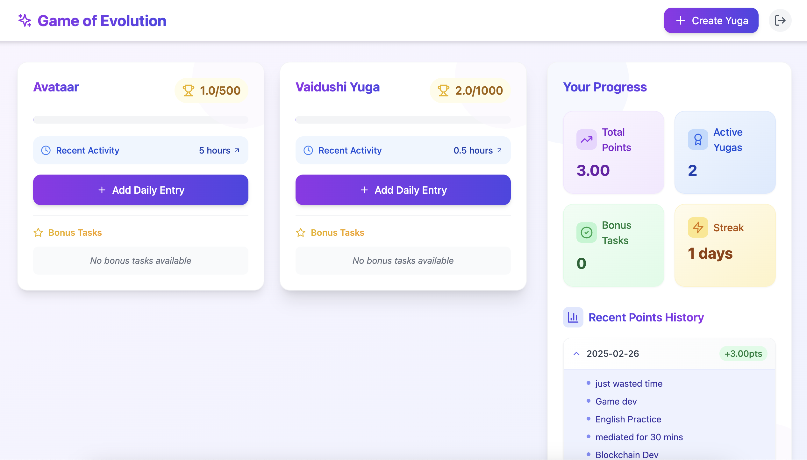
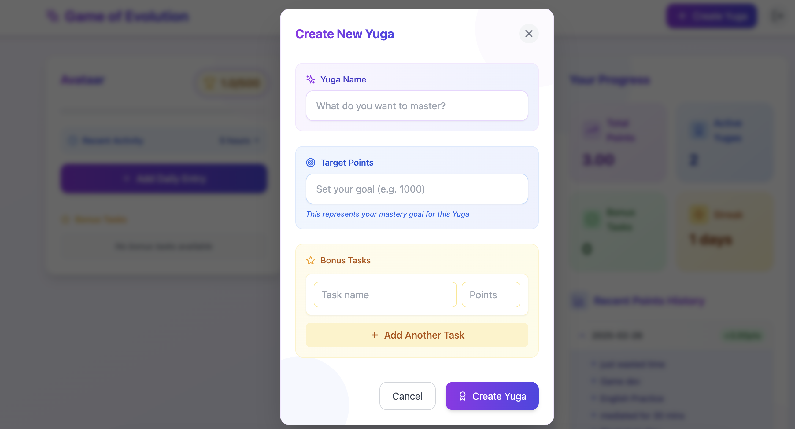

# Game of Evolution

Game of Evolution (GOE) is a unique personal development tracking system inspired by the concept of Yugas from Hindu philosophy. It combines long-term goal setting with daily consistency tracking, turning your personal growth journey into an engaging evolution game.

### Core Features
- **Yugas**: Create long-term projects or goals (called Yugas) with target points and bonus tasks
- **Daily Progress**: Log your daily activities with detailed entries and earn points based on time invested
- **Smart Points System**: 
  - Earn 0.2 points per hour for sessions longer than 2.5 hours
  - Maintain neutral (0 points) for 1-2.5 hour sessions
  - Face penalties (-1 point) for inactive days or sessions under 1 hour
- **Progress Tracking**: Visual progress bars, consistency streaks, and detailed statistics
- **Bonus Achievements**: Complete bonus tasks within each Yuga for additional points

The system encourages consistent daily effort over sporadic bursts of activity, helping you evolve steadily towards your goals.





## Quick Start

### Prerequisites
- Node.js (v16 or higher)
- npm or yarn
- Supabase account

### Environment Setup

1. Clone the repository
```bash
git clone https://github.com/pkkarn/GOE_SUPABASE
cd GOE_SUPABASE
```

2. Install dependencies
```bash
npm install
# or
yarn
```

3. Create a `.env` file in the root directory with your Supabase credentials:
```env
VITE_SUPABASE_URL=your_supabase_project_url
VITE_SUPABASE_ANON_KEY=your_supabase_anon_key
```

4. Run the development server
```bash
npm run dev
# or
yarn dev
```

5. Open [http://localhost:5173](http://localhost:5173) in your browser

## Database Setup

The app requires the following Supabase tables(you can add using SQL Editor):

```sql
-- yugas table
CREATE TABLE yugas (
  id uuid PRIMARY KEY DEFAULT gen_random_uuid(),
  user_id uuid REFERENCES auth.users NOT NULL,
  name text NOT NULL,
  target_points numeric NOT NULL,
  current_points numeric DEFAULT 0,
  created_at timestamptz DEFAULT now()
);

-- bonus_tasks table
CREATE TABLE bonus_tasks (
  id uuid PRIMARY KEY DEFAULT gen_random_uuid(),
  yuga_id uuid REFERENCES yugas ON DELETE CASCADE NOT NULL,
  name text NOT NULL,
  points numeric NOT NULL,
  completed boolean DEFAULT false,
  created_at timestamptz DEFAULT now()
);

-- daily_entries table
CREATE TABLE daily_entries (
  id uuid PRIMARY KEY DEFAULT gen_random_uuid(),
  yuga_id uuid REFERENCES yugas ON DELETE CASCADE NOT NULL,
  title text NOT NULL,
  description text,
  hours numeric NOT NULL,
  points numeric NOT NULL,
  created_at timestamptz DEFAULT now()
);
```

As signup page hasn't been implemented yet to it uses demo user, so for that you have to create a demo user inside your supabase inside `authentication` tab.

```
email: demo@example.com
pass: demo123
```

## Tech Stack
- React + Vite
- Tailwind CSS
- Supabase
- Lucide Icons 